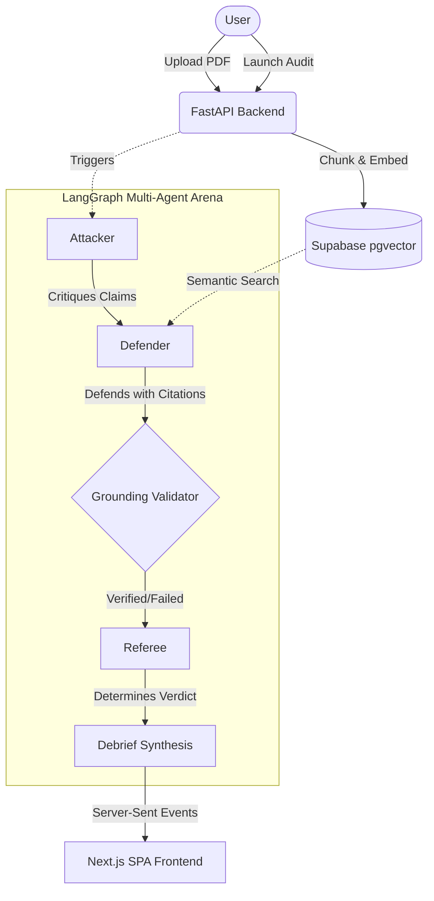

# Verdict — Adversarial Research Audit System

**Verdict** is an autonomous adversarial audit system designed to rigorously stress-test research papers. Instead of relying on passive LLM summaries—which are notoriously prone to confirmation bias and hallucinated citations—Verdict orchestrates a brutal, multi-agent debate directly against the source text. 

By pitting a skeptical **Attacker** against an author-advocating **Defender** and adjudicating their exchanges through an impartial **Referee**, Verdict extracts actionable flaws, solidifies verifiable facts, and enforces strict, deterministic citation validation on every single claim.

---

## 🧠 Core Concept & Personas

- **Attacker (Skeptic):** Interrogates methodology, searches for missing baselines, mathematical inconsistencies, unstated assumptions, and dataset limitations.
- **Defender (Advocate):** Grounded strictly in the paper's text. Defends the methodology using only what's actually in the document and concedes when it cannot produce evidence.
- **Validator (Trust Layer):** A deterministic, non-LLM check ensuring the Defender's citations actually exist in the retrieved text and are semantically consistent.
- **Referee (Judge):** Adjudicates each exchange, generating a final verdict with confidence scores:
  - ✅ **Solidified Fact:** Defender successfully refutes critique with verified citations.
  - ❌ **Actionable Flaw:** Defender cannot produce a citation, or it fails verification.
  - ⚠️ **Contested:** Valid citation, but only partially addresses the critique (flagged for human review).

### System Architecture



---

## 🕸️ LangGraph State Machine

Verdict heavily relies on **LangGraph** to orchestrate the adversarial debate as a structured, cyclic state graph rather than a loose chain of prompts.

- **State Management**: The graph maintains a strict `AuditState` that tracks the unfolding transcript, parsed citations, confidence scores, and retry counts across multiple exchanges.
- **Conditional Routing**: If an agent fabricates a citation (caught by the Validator node), the graph conditionally routes back to that agent, forcing a retry before proceeding to the Referee.
- **Streaming Output**: As the graph traverses its nodes (Attacker → Defender → Validator → Referee), state updates are intercepted and streamed to the frontend via Server-Sent Events (SSE) in real-time.

---

## 🚀 Features

- **Multi-Agent Adversarial Debate**: Powered by LangGraph with Gemini, Groq, and OpenRouter integration.
- **6 Fixed Round Topics**:
  1. Novelty, Scope & Problem Formulation (`novelty_scope`)
  2. Theoretical Soundness & Mathematical Rigor (`theoretical_soundness`)
  3. Experimental Setup, Datasets & Baselines (`experimental_setup`)
  4. Reproducibility, Compute & Ablation Studies (`reproducibility`)
  5. Limitations, Broader Impact & Edge Cases (`limitations_impact`)
  6. **Statistical Rigor & Methodological Validity** (`statistical_rigor`)
- **External Literature Grounding**: Live parallel search across Semantic Scholar, arXiv, and OpenAlex for prior art and baseline comparisons, with existence validation.
- **Novelty & Overlap Detection**: Embedding-based similarity comparison between paper abstracts and external candidates.
- **Deterministic Reproducibility Scanning**: Ingestion-time check for code, data, hyperparameter, compute, and random seed disclosures.
- **Multi-Provider LLM Fallback Router**: Sequential fallback across Gemini → Groq → OpenRouter on rate limits (`429`).
- **Self-Consistency Check**: Low-confidence Referee verdicts (`confidence < 0.5`) trigger re-adjudication, flagging disagreements as `CONTESTED`.
- **Deterministic Citation Validation**: Trust is built in, not assumed.
- **Single Page Application (SPA)**: Next.js frontend with split-screen document viewer.
- **Live SSE Streaming**: Watch the debate unfold in real-time.

---

## 🛠️ Quick Start

### Prerequisites
- Python 3.11+
- Node.js 18+
- [Supabase](https://supabase.com) project (free tier) for vector storage
- LLM API keys:
  - [Google AI Studio](https://aistudio.google.com) API key (`GEMINI_API_KEY`)
  - [Groq](https://console.groq.com) API key (`GROQ_API_KEY`, optional fallback)
  - [OpenRouter](https://openrouter.ai) API key (`OPENROUTER_API_KEY`, optional fallback)

### 1. Database Setup
1. Create a Supabase project at [supabase.com](https://supabase.com)
2. Go to **SQL Editor** and execute the files in `backend/migrations/` in numeric order, including `003_add_session_ownership_and_audit_errors.sql` for private paper access, durable failures, and embedding-space tracking.
3. Configure `SUPABASE_KEY` with a backend-only service-role/secret key. Never expose it through a `NEXT_PUBLIC_*` variable.

### 2. Backend (FastAPI)
```bash
cd backend

# Create virtual environment
python -m venv venv
source venv/bin/activate  # macOS/Linux

# Install dependencies
pip install -r requirements.txt

# Configure environment
cp .env.example .env
# Edit .env with your API keys and Supabase credentials

# Start the server
uvicorn app.main:app --reload --port 8000
```


### 3. Frontend (Next.js SPA)
```bash
cd frontend

# Install dependencies
npm install

# Configure environment (.env.local should point to http://localhost:8000)
# Start dev server
npm run dev
```

Visit [http://localhost:3000](http://localhost:3000) to enter the Arena.

---

## 🏗️ Project Structure

```text
Verdict/
├── frontend/          → Next.js SPA, Tailwind CSS v4, Porsche Design System
│   └── src/app/       → Consolidated routing and state management
├── backend/
│   ├── app/
│   │   ├── main.py    → FastAPI app entry point
│   │   ├── services/  → PDF ingestion, embedding, retrieval
│   │   ├── agents/    → System prompts, LangGraph nodes, Validator
│   │   └── api/       → REST + SSE endpoints
│   └── migrations/    → SQL schema for Supabase
```

## 🔌 API Endpoints

| Method | Path | Description |
|--------|------|-------------|
| POST | `/papers` | Upload + ingest a PDF |
| GET | `/papers/{id}/pdf` | Serve inline PDF for the document viewer |
| POST | `/audits` | Start a new adversarial audit |
| GET | `/audits/{id}/stream` | SSE stream of live multi-agent debate |
| GET | `/audits/{id}/debrief` | Completed debrief synthesis |

---
*Built for Authors, Reviewers, and Research Labs demanding uncompromised rigorous analysis.*
