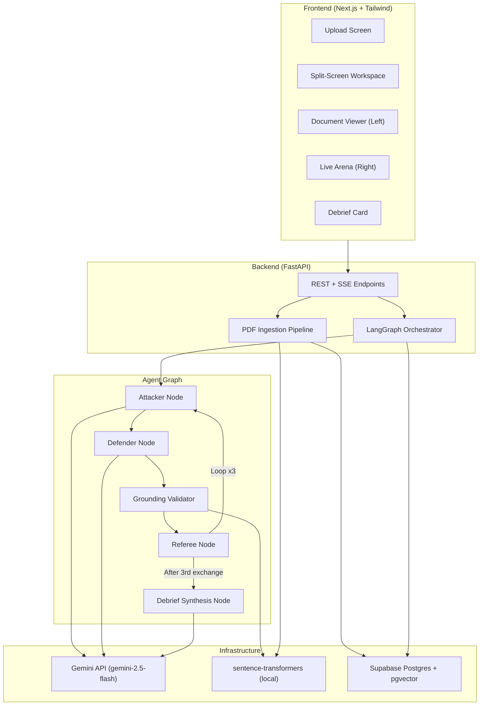
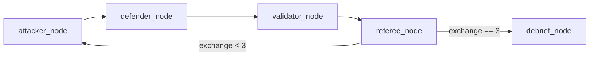

# Verdict — Phase 1 Implementation Plan

## Overview

Build the full end-to-end "Autonomous Multi-Agent Adversarial Research Audit System" — a user uploads a PDF, picks one of five round topics, and watches three AI personas (Attacker, Defender, Referee) debate the paper in real-time via SSE streaming. Each of 3 exchanges produces a citation-grounded verdict, followed by a Debrief Card.

## Architecture Summary



> [!IMPORTANT]
> **Gemini model**: The spec says `gemini-3.5-flash` in the prompt and `gemini-2.5-flash` in §9. I'll use `gemini-2.5-flash` as that's the real, existing model name. Configured as a constant so it's trivial to swap.

---

## Proposed Changes

### 1. Backend — Project Structure & Configuration

#### [NEW] `backend/` directory

```
backend/
├── app/
│   ├── __init__.py
│   ├── main.py                  # FastAPI app, CORS, lifespan
│   ├── config.py                # Settings (env vars, constants)
│   ├── constants.py             # Named constants (thresholds, chunk sizes, etc.)
│   ├── database.py              # Supabase/asyncpg connection
│   ├── models/
│   │   ├── __init__.py
│   │   ├── schemas.py           # Pydantic models (API request/response)
│   │   └── db_models.py         # DB entity models
│   ├── services/
│   │   ├── __init__.py
│   │   ├── pdf_service.py       # PDF parsing, validation, chunking
│   │   ├── embedding_service.py # sentence-transformers wrapper
│   │   ├── retrieval_service.py # Vector similarity search
│   │   └── llm_client.py        # Gemini client behind interface
│   ├── agents/
│   │   ├── __init__.py
│   │   ├── prompts.py           # System prompts for all personas
│   │   ├── schemas.py           # JSON output schemas for agents
│   │   ├── grounding_validator.py
│   │   └── graph.py             # LangGraph state machine
│   └── api/
│       ├── __init__.py
│       ├── papers.py            # POST /papers
│       ├── audits.py            # POST /audits, GET stream/turns/debrief
│       └── dependencies.py      # Shared deps (session ID extraction)
├── requirements.txt
├── .env.example
└── README.md
```

Key constants (in `constants.py`):
```python
CHUNK_SIZE_WORDS = 400          # Target ~300-500 words
CHUNK_OVERLAP_WORDS = 50
TOP_K_RETRIEVAL = 5
EXCHANGES_PER_ROUND = 3
GROUNDING_SIMILARITY_THRESHOLD = 0.6
MAX_PDF_PAGES = 40
MAX_PDF_SIZE_MB = 20
MIN_EXTRACTED_TEXT_LENGTH = 100  # Below this = likely scanned
EMBEDDING_DIMENSION = 384
GEMINI_MODEL = "gemini-2.5-flash"
```

---

### 2. Database Schema (Supabase Postgres + pgvector)

#### [NEW] `backend/migrations/001_initial_schema.sql`

Seven entities per spec §8:

```sql
-- Enable pgvector
CREATE EXTENSION IF NOT EXISTS vector;

CREATE TABLE papers (
    id UUID PRIMARY KEY DEFAULT gen_random_uuid(),
    filename TEXT NOT NULL,
    storage_path TEXT,
    page_count INTEGER,
    uploaded_at TIMESTAMPTZ DEFAULT NOW()
);

CREATE TABLE chunks (
    id UUID PRIMARY KEY DEFAULT gen_random_uuid(),
    paper_id UUID REFERENCES papers(id) ON DELETE CASCADE,
    section TEXT,
    text TEXT NOT NULL,
    embedding vector(384) NOT NULL,
    page_number INTEGER,
    chunk_index INTEGER,
    UNIQUE(paper_id, chunk_index)
);

CREATE TABLE audits (
    id UUID PRIMARY KEY DEFAULT gen_random_uuid(),
    paper_id UUID REFERENCES papers(id),
    session_id TEXT NOT NULL,
    round_topic TEXT NOT NULL,  -- slug enum
    strictness_level TEXT DEFAULT 'standard',
    depth TEXT DEFAULT 'fast',
    status TEXT DEFAULT 'pending',
    created_at TIMESTAMPTZ DEFAULT NOW()
);

CREATE TABLE rounds (
    id UUID PRIMARY KEY DEFAULT gen_random_uuid(),
    audit_id UUID REFERENCES audits(id) ON DELETE CASCADE,
    round_number INTEGER DEFAULT 1,
    topic TEXT NOT NULL,
    status TEXT DEFAULT 'in_progress'
);

CREATE TABLE turns (
    id UUID PRIMARY KEY DEFAULT gen_random_uuid(),
    round_id UUID REFERENCES rounds(id) ON DELETE CASCADE,
    exchange_number INTEGER NOT NULL,
    agent_type TEXT NOT NULL,  -- attacker/defender/referee/validator
    sequence INTEGER NOT NULL,
    content JSONB NOT NULL,
    created_at TIMESTAMPTZ DEFAULT NOW()
);

CREATE TABLE verdicts (
    id UUID PRIMARY KEY DEFAULT gen_random_uuid(),
    round_id UUID REFERENCES rounds(id) ON DELETE CASCADE,
    exchange_number INTEGER NOT NULL,
    claim_summary TEXT,
    verdict_type TEXT NOT NULL,  -- SOLIDIFIED/ACTIONABLE_FLAW/CONTESTED
    confidence FLOAT,
    rationale TEXT,
    cited_chunk_ids JSONB
);

CREATE TABLE debrief_cards (
    id UUID PRIMARY KEY DEFAULT gen_random_uuid(),
    round_id UUID REFERENCES rounds(id) ON DELETE CASCADE,
    executive_synthesis TEXT,
    solidified_strengths JSONB,
    actionable_weaknesses JSONB,
    contested_points JSONB,
    created_at TIMESTAMPTZ DEFAULT NOW()
);

-- Indexes
CREATE INDEX idx_chunks_paper ON chunks(paper_id);
CREATE INDEX idx_audits_session ON audits(session_id);
CREATE INDEX idx_turns_round ON turns(round_id, exchange_number, sequence);
CREATE INDEX idx_verdicts_round ON verdicts(round_id, exchange_number);
```

> [!NOTE]
> I'm omitting `parsed_text` from the `papers` table as a stored column — the full text is reconstructed from chunks when needed, avoiding duplicating potentially large text blobs. If you need the raw text stored, I can add it.

---

### 3. Backend Services

#### [NEW] `backend/app/services/pdf_service.py`
- Uses `PyMuPDF` (fitz) for parsing — faster and more reliable than pdfplumber for text extraction
- Validates: file size ≤ 20MB, page count ≤ 40, extracted text ≥ 100 chars
- Chunking: splits on paragraph boundaries (`\n\n`), targeting 300-500 words per chunk with 50-word overlap
- Returns list of chunks with page numbers and section info

#### [NEW] `backend/app/services/embedding_service.py`
- Loads `all-MiniLM-L6-v2` once at startup (singleton)
- `embed_text(text) -> List[float]` and `embed_batch(texts) -> List[List[float]]`
- CPU-only, no API calls

#### [NEW] `backend/app/services/retrieval_service.py`
- `retrieve_chunks(paper_id, query, top_k=5) -> List[Chunk]`
- Uses pgvector `<=>` cosine distance operator
- Attacker query: round topic + prior claim summaries (anti-repetition)
- Defender query: attacker's critique text + cited chunk IDs

#### [NEW] `backend/app/services/llm_client.py`
- Abstract `LLMClient` interface with `generate(system_prompt, user_prompt, schema) -> dict`
- `GeminiClient` implementation using `google-generativeai` SDK
- Exponential backoff on 429 errors (3 retries, 2/4/8 second delays)
- JSON mode output with schema validation
- In-process asyncio Lock for concurrency control (one audit at a time)

---

### 4. Agent Graph (LangGraph)

#### [NEW] `backend/app/agents/graph.py`

LangGraph state machine with 5 nodes:



**State schema:**
```python
class AuditState(TypedDict):
    paper_id: str
    round_id: str
    round_topic: str
    exchange_number: int
    prior_claims: list[str]       # Anti-repetition context
    current_attacker_turn: dict
    current_defender_turn: dict
    attacker_validation: list[dict]
    defender_validation: list[dict]
    current_verdict: dict
    all_turns: list[dict]         # Full transcript for debrief
    sse_queue: asyncio.Queue      # For streaming to frontend
    attacker_critique_valid: bool # Whether attacker's citations passed
```

**Key logic per node:**

1. **Attacker node**: Retrieve top-5 chunks using topic + prior claims → call LLM with attacker prompt → parse JSON → store turn
2. **Defender node**: Retrieve top-5 chunks using attacker's critique → call LLM with defender prompt → parse JSON → store turn
3. **Validator node** (deterministic, no LLM):
   - Validate attacker citations (if not omission type) — if any fail, discard exchange, increment exchange_number, loop back to attacker
   - Validate defender citations (if not concession) — pass results to referee
   - Uses embedding similarity with threshold `GROUNDING_SIMILARITY_THRESHOLD = 0.6`
4. **Referee node**: Receives attacker critique + defender rebuttal + all validation results → call LLM → produce verdict → store turn + verdict
5. **Debrief node**: After 3 exchanges, one LLM call with full transcript → produce 4-section debrief card → store

> [!IMPORTANT]
> **Attacker citation validation failure handling**: Per spec §7.1, if the Attacker's own citations fail validation, the exchange is discarded before reaching the Defender. I'll implement this as: the Attacker gets one retry with the same exchange number, and if it fails again, we skip that exchange and move on. This prevents infinite loops while respecting the spec.

---

### 5. API Layer (FastAPI)

#### [NEW] `backend/app/api/papers.py`

**`POST /papers`**
- Accepts multipart file upload
- Runs validation pipeline (size, pages, text content)
- Parses → chunks → embeds → stores in DB
- Returns `{ paper_id, filename, page_count, chunk_count }`

#### [NEW] `backend/app/api/audits.py`

**`POST /audits`**
- Body: `{ paper_id, round_topic }` (topic must be one of the 5 slugs)
- Scoped to `X-Session-Id` header
- Creates Audit + Round rows
- Kicks off the LangGraph agent in background
- Returns `{ audit_id, round_id, status: "in_progress" }`

**`GET /audits/{audit_id}/stream`**
- SSE endpoint streaming turns as they're generated
- Events: `turn` (with agent_type, exchange_number, content), `verdict`, `debrief`, `complete`, `error`

**`GET /audits/{audit_id}/turns`**
- Polling fallback: returns all turns and verdicts so far
- Includes `exchange_number` for grouping

**`GET /audits/{audit_id}/debrief`**
- Returns the completed DebriefCard or 404 if not yet generated

---

### 6. Frontend (Next.js + TypeScript + Tailwind)

#### [NEW] `frontend/` directory

```
frontend/
├── src/
│   ├── app/
│   │   ├── layout.tsx
│   │   ├── page.tsx             # Upload screen
│   │   ├── globals.css
│   │   └── audit/
│   │       └── [id]/
│   │           └── page.tsx     # Split-screen workspace
│   ├── components/
│   │   ├── upload/
│   │   │   ├── DropZone.tsx
│   │   │   └── TopicPicker.tsx
│   │   ├── workspace/
│   │   │   ├── DocumentViewer.tsx
│   │   │   ├── LiveArena.tsx
│   │   │   ├── TurnCard.tsx
│   │   │   ├── VerdictBadge.tsx
│   │   │   └── DebriefCard.tsx
│   │   └── ui/
│   │       ├── LoadingSpinner.tsx
│   │       └── ErrorBanner.tsx
│   ├── hooks/
│   │   ├── useSession.ts        # localStorage UUID management
│   │   ├── useSSE.ts            # SSE + polling fallback
│   │   └── useAudit.ts          # Audit state management
│   ├── lib/
│   │   ├── api.ts               # API client with X-Session-Id
│   │   └── constants.ts         # Topic list, colors, etc.
│   └── types/
│       └── index.ts             # TypeScript types
├── tailwind.config.ts
├── next.config.js
├── package.json
└── tsconfig.json
```

#### Design System

| Element | Style |
|---------|-------|
| Background | Dark mode: `#0a0a0f` → `#12121a` gradient |
| Attacker turns | Coral/red accent (`#ff6b6b` → `#ee5a24`) |
| Defender turns | Teal/green accent (`#00d2d3` → `#10ac84`) |
| Referee turns | Neutral silver (`#a4b0be`) |
| Verdict: Solidified | Emerald glow (`#2ed573`) |
| Verdict: Actionable Flaw | Amber/red (`#ff4757`) |
| Verdict: Contested | Gold/amber (`#ffa502`) |
| Cards | Glassmorphism: `backdrop-blur-xl`, `bg-white/5`, subtle borders |
| Typography | Inter (body), JetBrains Mono (code/JSON) |
| Animations | Framer Motion for turn entry, verdict reveals |

#### Upload Screen
- Full-screen dark gradient with centered card
- Drag-and-drop zone with animated border
- 5-topic radio selector with descriptions
- Clear error states for rejected PDFs (oversized, scanned, etc.)
- "Start Audit" button with loading state

#### Split-Screen Workspace
- **Left (Document Viewer)**: Renders PDF pages using `react-pdf`. When a turn cites chunks, scrolls to and highlights the relevant page with a pulsing glow overlay.
- **Right (Live Arena)**: Streaming chat-like interface. Each turn slides in with a staggered animation. Persona-colored left borders. Grouped by exchange number with clear visual separators.
- **Verdict badges**: Appear after each exchange with the 3-state icon + confidence score
- **Debrief Card**: Full-width accordion at the bottom after round completion, with the four sections expandable

#### SSE + Polling Fallback
- `useSSE` hook connects to `/stream` endpoint
- On connection error or 3 missed heartbeats, switches to polling `/turns` every 2 seconds
- Visual indicator shows "Live" vs "Reconnecting..." status
- When stream resumes, stops polling

---

### 7. Configuration & DevEx

#### [NEW] `backend/.env.example`
```
GEMINI_API_KEY=
SUPABASE_URL=
SUPABASE_KEY=
SUPABASE_DB_URL=
```

#### [NEW] `frontend/.env.example`
```
NEXT_PUBLIC_API_URL=http://localhost:8000
```

#### [NEW] `README.md`
Setup instructions for local development:
1. Clone repo
2. Set up Supabase project (or local Postgres + pgvector)
3. Run migration
4. Install backend deps, start FastAPI
5. Install frontend deps, start Next.js
6. Upload a PDF and run an audit

---

## Open Questions

> [!IMPORTANT]
> **Supabase credentials**: Do you have a Supabase project set up already, or should I include instructions for creating one? I'll build with the Supabase Python client (`supabase-py`) for data operations and raw `asyncpg` for the pgvector similarity queries (since Supabase's client doesn't natively support pgvector operators).

> [!IMPORTANT]
> **PDF rendering in frontend**: I plan to use `react-pdf` (which wraps PDF.js) to render the actual PDF pages in the Document Viewer. This requires storing or serving the uploaded PDF file. Should I:
> - **Option A** (Recommended): Store the PDF in the backend's local filesystem and serve it via a FastAPI static endpoint — simplest for Phase 1
> - **Option B**: Upload to Supabase Storage and serve from there

> [!NOTE]
> **Gemini API key**: The key provided in the prompt will be placed in `.env` locally. I'll ensure it never appears in committed code.

---

## Verification Plan

### Automated Tests
```bash
# Backend unit tests
cd backend && pytest tests/ -v

# Type checking
cd frontend && npx tsc --noEmit
```

### Manual Verification (Acceptance Criteria)
1. Upload a real text-based research PDF → successful ingestion, chunks visible in DB
2. Upload a >40 page PDF → clear rejection error
3. Upload a >20MB PDF → clear rejection error  
4. Upload a scanned/image-only PDF → clear rejection error
5. Select "Experimental Setup, Datasets & Baselines" topic → start audit
6. Watch 3 exchanges stream live (Attacker → Defender → Referee each)
7. Verify no repeated critiques across exchanges
8. Verify verdicts are citation-grounded (check DB for validation results)
9. Verify Debrief Card appears with all 4 sections after exchange 3
10. Disconnect network mid-stream → frontend falls back to polling
11. Full run completes without unhandled rate-limit errors
